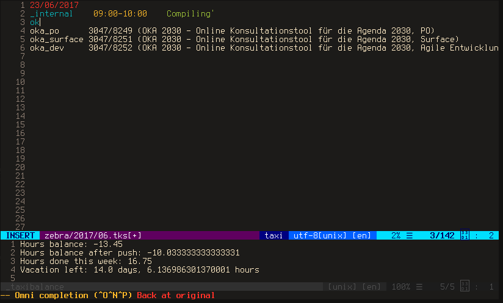

# taxi.vim

Vim plugin for the [taxi timesheeting tool](https://github.com/sephii/taxi/) 
that makes your life easier




## Features

* Syntax highlighting
* Alias completion when adding a new line
* Output of the balance ever time the timesheet gets saved
* Aligning the timesheet entries
* Automatic async update of the aliases


## Installation

Simply add this repository to your plugin manager, e.g. [dein](https://github.com/Shougo/dein.vim):

```
call dein#add('schtibe/taxi.vim')
```

If you don't have one, put the content of the folders in your vim 
configuration folder: 

* ~/.config/nvim/syntax and ~/.config/nvim/ftplugin) in case of neovim
* ~/.vim/syntax and ~/.vim/ftplugin in case of vim


## Usage of the alias completion

To complete the aliases use vim's [omnicomplete functionality](http://vim.wikia.com/wiki/Omni_completion):

Start typing a word, then hit `CTRL-x` and `CTRL-o` consecutively to complete 
it. The completion is automatically spawned when adding a new line.


## Special Thanks


I did not write the syntax file, so thanks to whoever wrote it and contributed 
to it. To me it made sense to include this here to have a single point of
vim taxi functionality.


## Bugs

* The alias loading thing seems a bit unstable yet. Also, I'm not a 100% sure
    that new aliases are loaded correctly
